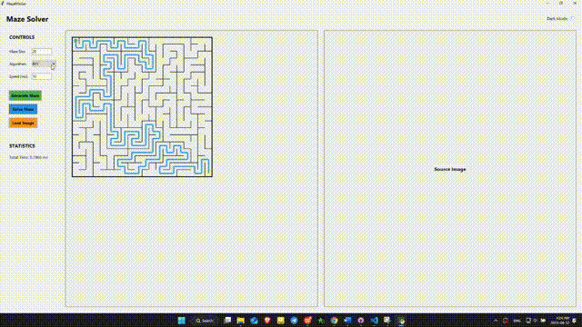
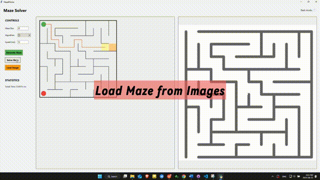
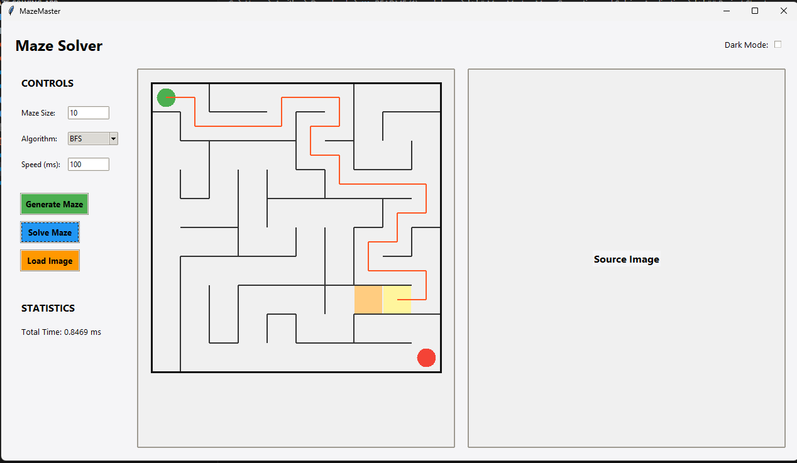
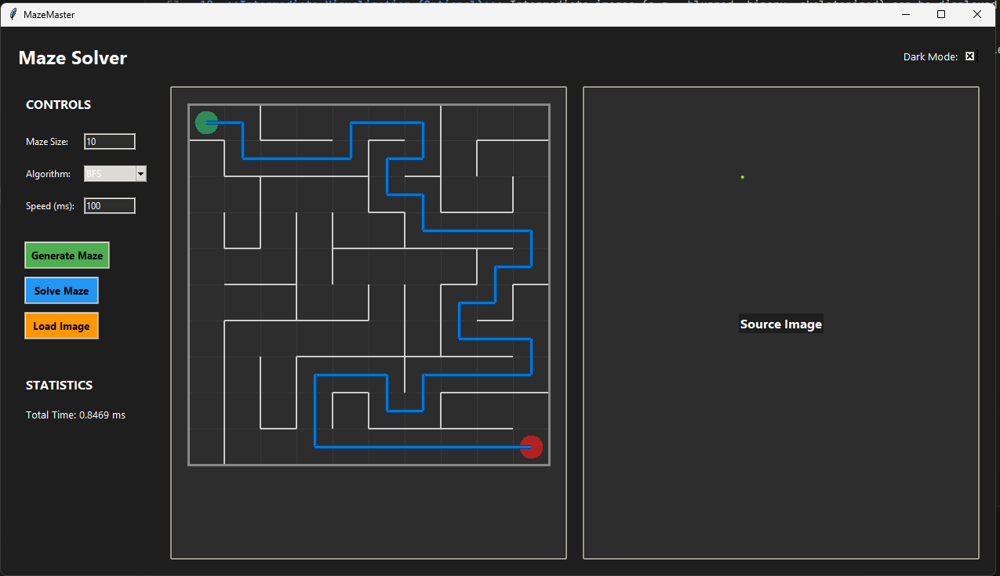
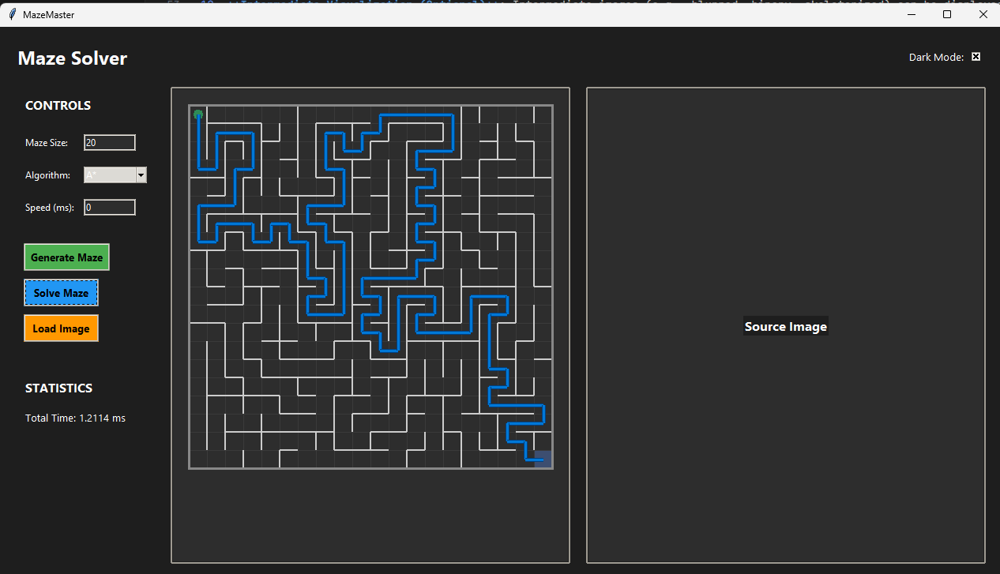
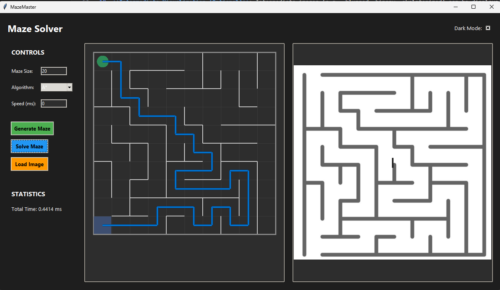

# 🧩 MazeMaster: Maze Generation and Solving Application

- **Solving Animation**: Generating and solving a maze with step-by-step visualization.  
  

- **Maze from image**: Load maze from images and solve.
  

## 📝 About the Project

MazeMaster is a 🐍 Python-based desktop application designed for generating, visualizing, and solving square mazes using various pathfinding algorithms. It provides an intuitive graphical user interface (GUI) built with Tkinter 🖼️, allowing users to generate random mazes, solve them with different algorithms, and visualize the solving process. Additionally, the application supports uploading maze images 🖼️, processing them using computer vision techniques 👁️‍🗨️, and solving the detected maze. The project also includes a script to analyze the performance 📊 of different solving algorithms across multiple maze sizes.

## 🌟 Features

With MazeMaster, users can:
- 🔀 **Generate Random Mazes**: Create square mazes of customizable sizes using a depth-first search (DFS) algorithm.
- 🧠 **Solve Mazes**: Use BFS, Dijkstra’s, or A* algorithms to solve the mazes.
- 🎞️ **Visualize Solutions**: Watch the solving process with animated steps.
- 🖼️ **Upload and Solve Maze Images**: Upload PNG or JPEG maze images and solve them via computer vision.
- 🎯 **Select Start and End Points**: Click to select starting and ending points on image-based mazes.
- 🌗 **Toggle Themes**: Switch between light and dark mode.
- ⏱️ **View Statistics**: See the time it took to solve the maze.
- 📈 **Performance Analysis**: Compare solving algorithm performance on various maze sizes.

## 🧰 Technologies Used

- 🐍 **Python 3** – Core programming language.
- 🖼️ **Tkinter** – GUI and visualization.
- 🔍 **OpenCV** – Image processing.
- ➗ **NumPy** – Numerical operations.
- 🖌️ **Pillow (PIL)** – Image display.
- 📊 **Matplotlib** – Debug image plotting.
- 🪟 **Batch Script (Windows)** – Easy setup.

## 🧮 Algorithms

### 🏗️ Maze Generation
- **DFS (Depth-First Search)**: Randomized DFS creates perfect mazes with unique solutions.

### 🚀 Maze Solving
- **BFS**: Finds the shortest path level by level.
- **Dijkstra’s Algorithm**: Uses a priority queue to track shortest distances.
- **A\***: Optimized search using heuristics (Manhattan distance).

## 🧠 Image Processing for Maze Detection

Steps for image-to-maze conversion:
1. 📏 **Resize Image** to 800x800
2. 🌫️ **Apply Gaussian Blur**: A Gaussian blur is applied to reduce noise and smooth the image.
3. 🖤 **Convert to Grayscale**: The image is converted to grayscale to simplify further processing.
4. ⚫ **Binary Thresholding**
5. 🔄 **Morphological Closing**: A morphological closing operation fills small gaps in the maze walls using a 5x5 kernel.
6. 🦴 **Skeletonization**: The binary image is thinned to produce a skeleton, reducing walls to single-pixel lines for easier line detection.
7. ⚡ **Canny Edge Detection**: Canny edge detection is applied to the skeletonized image to identify edges.
8. 📏 **Hough Line Transform**:  Detects horizontal and vertical lines in the maze, which represent the grid structure.
9. 🔍 **Line Filtering**: Lines are separated into horizontal and vertical groups, and duplicates within 5 pixels are removed to avoid redundant lines.
10. ↔️ **Line Extension**: Detected lines are extended to span the entire 800x800 image, ensuring a complete grid.
11. 🔗 **Graph Construction**: The grid is used to create a graph where nodes represent cells, and edges are added where paths exist (based on pixel values in the binary image). The graph is then used for solving.

## Project Structure

The project directory contains the following files and folders:
```
MazeMaster/
├── test_images/              # Folder containing sample maze images (PNG/JPEG) for testing
│   ├── maze1.jpg            # Example maze image
│   └── ...                  # Additional test images
├── maze_app.py              # Main application with Tkinter GUI and pathfinding algorithms
├── maze_classes.py          # Defines Node and Graph classes for maze representation and generation
├── vision_handler.py        # Simplified computer vision module for maze detection from images
├── vision_steps.py          # Extended vision processing with intermediate image visualization for debugging
├── statistic_calc.py        # Script to analyze performance of solving algorithms
├── run_app.bat              # Windows batch script for dependency installation and running the app
├── requirements.txt         # Lists required Python packages
└── README.md                # Project documentation (this file)
```

## ▶️ How to Run the Project

### 📋 Prerequisites
- 🐍 Python 3.6+
- 📦 pip

### 🛠️ Installation and Execution
1. **Clone the Repository**:
   ```bash
   git clone <repository-url>
   cd <repository-directory>
   ```

2. **Install Dependencies**:
   - 🪟 On **Windows**:
     ```bash
     run_app.bat
     ```
   - 🐧 On **Other OS**:
     ```bash
     pip install -r requirements.txt
     ```

3. **Run the Application**:
   ```bash
   python maze_app.py
   ```

4. **Run Statistical Analysis** (Optional):
   ```bash
   python statistic_calc.py
   ```

### 🧑‍💻 Usage
- 🔄 **Generate a Maze**: Choose a size and algorithm, then click "Generate Maze".
- 🧠 **Solve a Maze**: Click "Solve Maze" and watch it in action.
- 🖼️ **Load an Image**: Click to load, then select start/end points and solve.
- 🌙 **Toggle Theme**: Use "Dark Mode" checkbox.
- 📈 **View Statistics**: Shows solving time after completion.

## 📁 Project Structure
- `maze_app.py`: Main GUI app.
- `maze_classes.py`: Maze logic.
- `vision_handler.py`: Simple image processing.
- `vision_steps.py`: Detailed image processing.
- `statistic_calc.py`: Performance analysis.
- `run_app.bat`: Windows setup script.
- `requirements.txt`: Dependencies.

## ⚠️ Notes
- Use clear, high-contrast maze images.
- Only square mazes are supported.
- Click inside the grid for start and end on image mazes.

## More Screenshots
- **Generated Maze**: A randomly generate maze and solve. 
  
  
  
  
- **Image-Based Maze**: A maze loaded from an image, with user-selected start and end points.  
  
